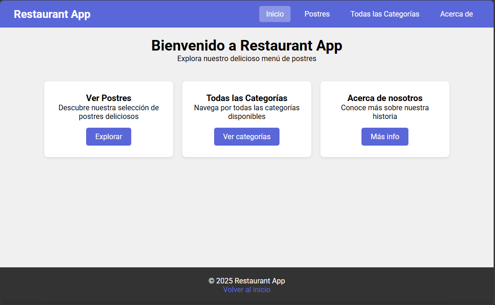
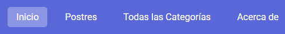
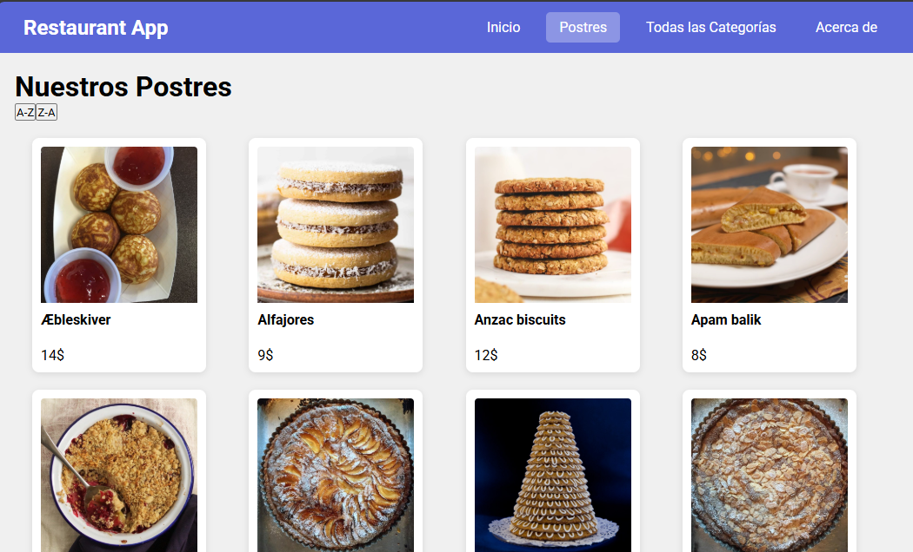
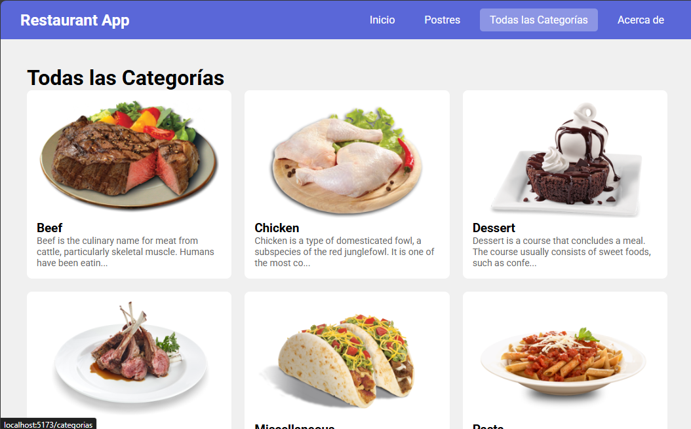
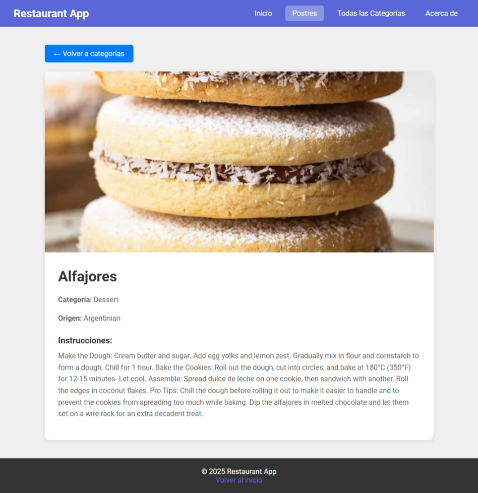

# Restaurant App - Ejercicio 2

Aplicación web de restaurante creada con React y Vite. Esta es la continuación del Ejercicio 1, ahora con sistema de navegación y rutas anidadas.

## Nuevas funcionalidades

- Sistema de navegación con React Router
- Navegación dinámica por categorías
- Vista detallada de cada postre
- Layout con navbar siempre visible
- Múltiples páginas y rutas anidadas

## Tecnologías utilizadas

- React
- Vite
- React Router DOM
- TheMealDB API
- React Loading Indicators

## Rutas implementadas

- `/` - Página de inicio
- `/categorias` - Lista de postres
- `/categorias/:id` - Detalle de un postre específico
- `/todas-categorias` - Todas las categorías disponibles
- `/categoria/:categoria` - Postres de una categoría
- `/categoria/:categoria/:id` - Detalle desde categoría
- `/about` - Información sobre la app

## Navegación

La app cuenta con un navbar fijo en la parte superior que permite navegar entre:
- Inicio
- Postres
- Todas las Categorías
- Acerca de

## Funcionalidades principales

### Vista de postres
Lista de postres de la categoría Dessert con opción de ordenar alfabéticamente (A-Z o Z-A).

### Navegación por categorías
Se pueden explorar todas las categorías disponibles en la API y ver los platos de cada una.

### Detalle de postre
Al hacer click en cualquier postre, se muestra su información detallada: imagen, nombre, categoría, origen e instrucciones.

## Instalación

npm install

## Ejecutar el proyecto

npm run dev

## API utilizada

TheMealDB - https://www.themealdb.com/api.php

---

**Autor:** Daniel Alonso
**Curso:** 2º DAM  
**Asignatura:** DAD
