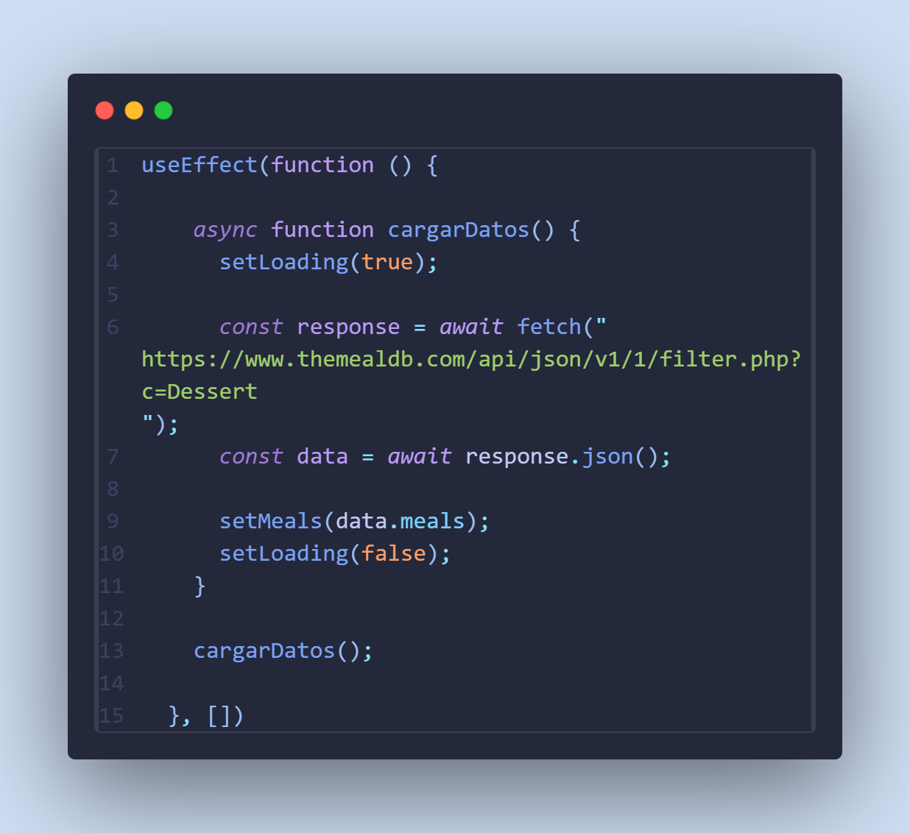
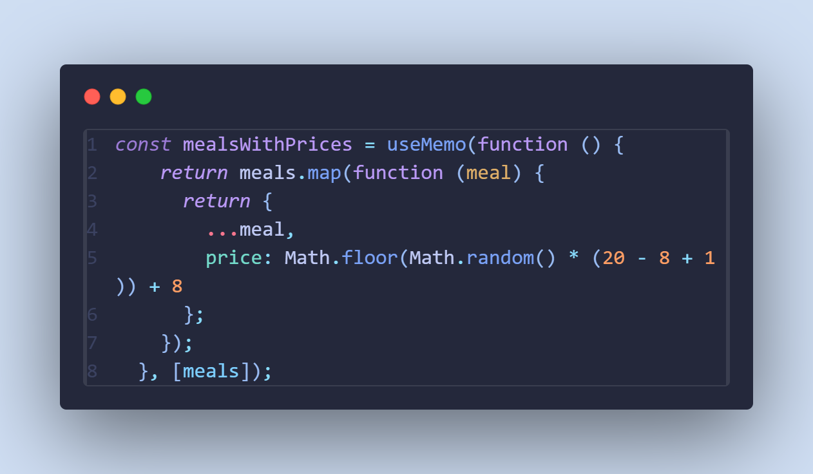
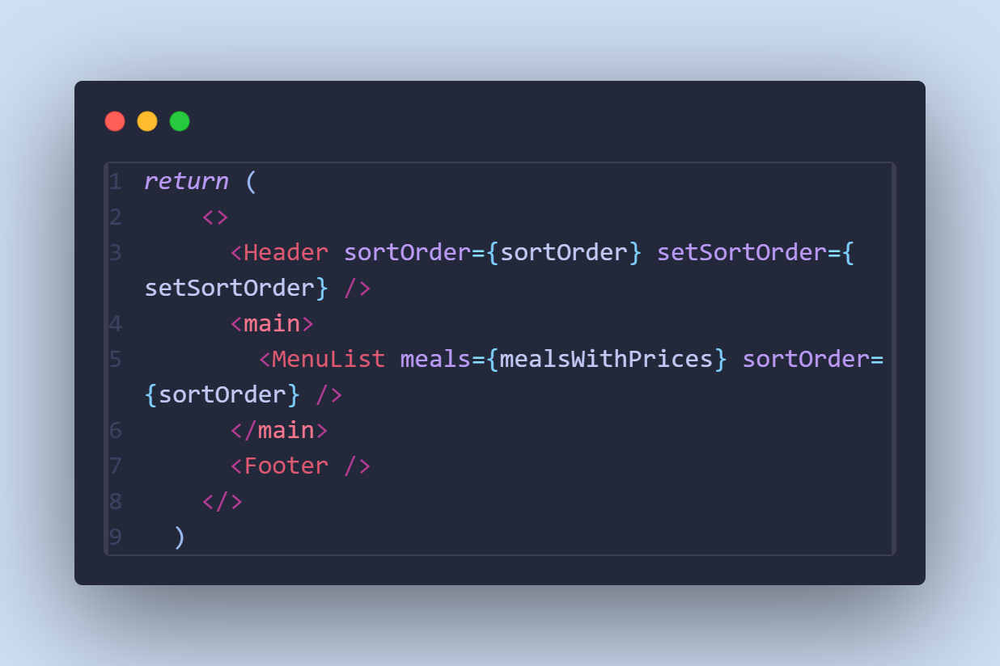
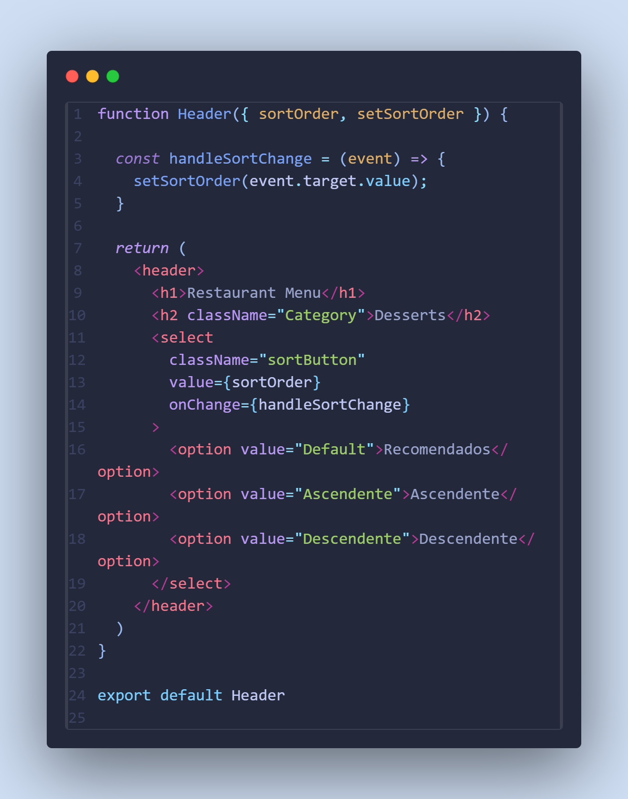
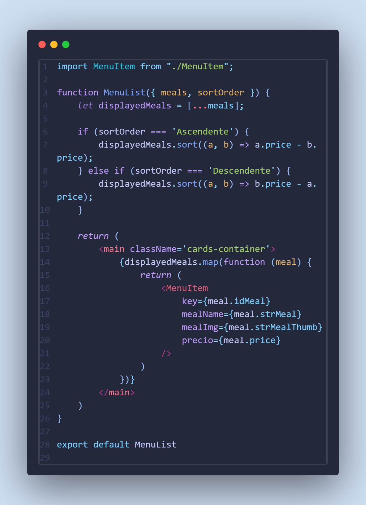
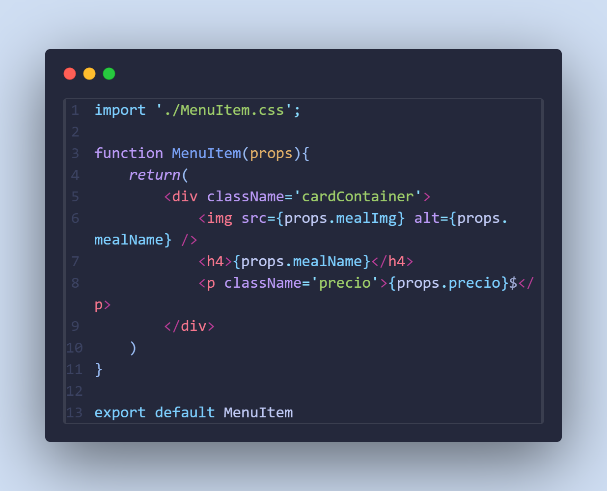
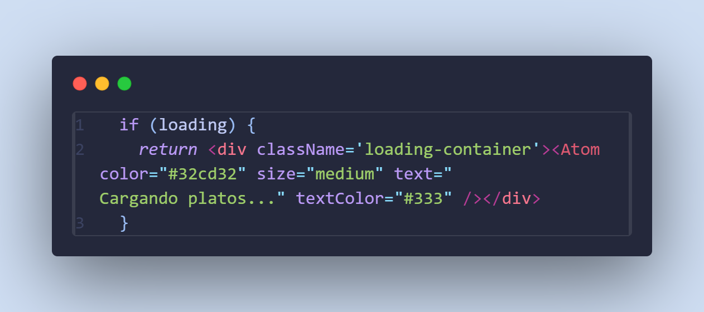

# Restaurante - Carta React

Es una aplicación web hecha con React y Vite, que muestra una carta de postres de un restaurante. La app conecta con la API de TheMealDB para sacar los datos, y luego enseña los postres con su nombre, imagen y un precio que se genera aleatoriamente cada vez que entras.

# ¿Qué puede hacer la app?

- Ver una lista de postres (con foto y precio)
- Ordenar los postres por precio (de más barato a caro y al revés) o ver primero los recomendados
- Carga animada usando react-loading-indicators
- Diseño responsivo (se adapta a distintos tamaños de pantalla)

# ¿Como se ha hecho?

- Se ha usado Vite para crear el proyecto React.
- En App.jsx se realiza una petición asíncrona al endpoint:
  https://www.themealdb.com/api/json/v1/1/filter.php?c=Dessert
  
- Los datos se almacenan en el estado local y se generan precios aleatorios entre 8 y 20 $.
- Además se ha usado el hook useMemo para guardar los precios y no re-renderizar los componentes.
  
- Se han ido pasando los props correspondientes entre componentes.
  
- Los componentes principales son:
- Header.jsx → título y selector de ordenamiento.
  
- MenuList.jsx → lista de platos según el orden elegido.
  
- MenuItem.jsx → tarjeta de cada postre.
  
- Footer.jsx → enlace para volver al inicio.
- Se añadió un indicador de carga usando el paquete react-loading-indicators.
  

# Dependencias instaladas

- react y react-dom
- react-loading-indicators
- vite
- @vitejs/plugin-react
